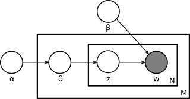

.. _lda:

Latent Dirichlet allocation
===========================
.. _Wikipedia: https://en.wikipedia.org/wiki/Latent_Dirichlet_allocation
.. _bag of words: https://en.wikipedia.org/wiki/Bag-of-words_model

This documentation refers to this link: `Wikipedia`_

- In natural language processing, latent Dirichlet allocation (LDA) is a generative statistical model that allows sets of observations to be explained by unobserved groups that explain why some parts of the data are similar.
- For example, if observations are words collected into documents, it posits that each document is a mixture of a small number of topics and that each word's creation is attributable to one of the document's topics.
- LDA is an example of a topic model and was first presented as a graphical model for topic discovery by David Blei, Andrew Ng, and Michael I. Jordan in 2003.
    http://jmlr.csail.mit.edu/papers/v3/blei03a.html

Topics
______
- In LDA, each document may be viewed as a mixture of various topics.
- For example, an LDA model might have topics that can be classified as CAT_related and DOG_related.
    - A topic has probabilities of generating various words, such as milk, meow, and kitten, which can be classified and interpreted by the viewer as "CAT_related".
    - The DOG_related topic likewise has probabilities of generating each word: puppy, bark, and bone might have high probability.
- A topic is not strongly defined, neither semantically nor epistemologically. It is identified on the basis of supervised labeling and (manual) pruning on the basis of their likelihood of co-occurrence.
- A lexical word may occur in several topics with a different probability, however, with a different typical set of neighboring words in each topic.
- Each document is assumed to be characterized by a particular set of topics. This is akin to the standard `bag of words`_ model assumption, and makes the individual words exchangeable.

Model
_____
- With plate notation, the dependencies among the many variables can be captured concisely. The boxes are “plates” representing replicates. The outer plate represents documents, while the inner plate represents the repeated choice of topics and words within a document. M denotes the number of documents, N the number of words in a document.
    |Lda model|

Thus:

    - α is the parameter of the Dirichlet prior on the per-document topic distributions,
    - β is the parameter of the Dirichlet prior on the per-topic word distribution,
    - :math:`\theta_{i}` is the topic distribution for document i,
    - :math:`\varphi_{k}` is the word distribution for topic k,
    - :math:`z_{ij}` is the topic for the jth word in document i,
    - :math:`w_{ij}` is the specific word.

The :math:`w_{ij}` are the only observable variables, and the other variables are latent variables.

