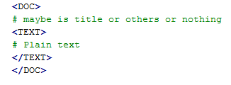

.. -*- coding: utf-8 -*-

=================================
Preprocessing
=================================
This work will be implemented when data format of corpus is raw text. Topic models take documents that contain words as input. We still have to determine what "words" we're going to use and how to extract them from the format raw text. Recall that most topic models treat documents as a bag-of-words, so we can stop caring about the order of the tokens within the text and concentrate on how many times a particular word appears in the text. So, we need to convert the raw format to term-sequence or term-frequency as mentioned in the `quick start`_ section. To understand in detail about technique of preprocessing, please read preprocessing [1]_ document. 

File raw text also need a specific format type so that we can recognize it. The format of file   as follow:

- Corpus includes many documents, all of that are saved into a file. 
- Each document is represented as follow

.. _quick start: ./quick_start.html
   
Please refer [1]_ to know more detail about preprocessing technique

-----------------------------------------------------
class PreProcessing
-----------------------------------------------------

::

  tmlib.preprocessing.PreProcessing(file_path, stemmed=False, remove_rare_word=3, remove_common_word=None)

Parameters
===========

- **file_path**: string, not default 

  Path of file corpus which has raw text format.
- **stemmed**: boolean, default: False
  
  Appply the stemming algorithm (Porter, 1980) to preprocess text data. The algorithm is applied when parameter is set value *True*

- **remove_rare_word**: int, default: 3

  Removing rarely words in the documents. Default, words which appeared in less 3 documents will be removed

- **remove_common_word**: int, default: None

  Removing common words (which appeared in many documents). Default, words which appeared in greater a half documents of corpus will be removed.

Attributes
==========

- **path_file_vocab**: string,

  path of the vocabulary file which created after calling method *extract_vocab()*

- **path_file_tf**: string,
 
  path of file corpus with term-frequency format. This file is created after calling method *save_format_tf()*

- **path_file_sq**: string,
 
  path of file corpus with term-sequence format. This file is created after calling method *save_format_sq()*

Methods
=======

- __init__(*file_path, stemmed=False, remove_rare_word=3, remove_common_word=None*)
- **process()**

  run the preprocessing algorithms

- **extract_vocab** (folder=None)

  Extracting to the file vocabulary of corpus after preprocessing
  
  - **Parameters**: folder (string, default: None)

    The position which file vocabulary is saved. By default, file is saved in a folder with path  *<user home folder> + "tmlib_data/" + <name of file input>* 

- **save_format_sq** (folder=None)

  Extracting to the file corpus with term-sequence format

  - **Parameters**: folder (string, default: None)

    The position which file term-sequence is saved. By default, file is saved in a same folder with file vocablary created above

- **save_format_tf** (folder=None)

  Extracting to the file corpus with term-frequency format

  - **Parameters**: folder (string, default: None)

    The position which file term-frequency is saved. By default, file is saved in a same folder with file vocablary created above
	
-------
Example
-------
	
This is a tutorial for how to preprocess a file raw text. Using AP raw corpus `here`_

.. _here:  https://github.com/hncuong/topicmodel-lib/tree/master/examples/ap/data

::
    
  from tmlib.preprocessing import PreProcessing

  p = PreProcessing('data/ap_train_raw.txt')                  
  p.process()                  # run algorithm of preprocessing step
  p.extract_vocab()            # extract to the vocabulary of corpus
  p.save_format_sq()           # save the new format is term-sequence format
  p.save_format_tf()           # save the format is term-frequency format
  # display path of file vocabulary, file term-sequence, file term-frequency
  print(object.path_file_vocab, object.path_file_sq, object.path_file_tf)

The result files is automatically saved in a folder named "tmlib_data" in the user data home. User can change the position by set value parameters in functions such as extract_vocab(), save_format_sq() or save_format_tf(). User can also change the setting parameters of preprocessing algorithm by set value when create object

.. [1] Care and Feeding of Topic Models: Problems, Diagnostics, and Improvements. Jordan Boyd Graber, David Mimno, and David Newman. In Handbook of Mixed Membership Models and Their Applications, CRC/Chapman Hall, 2014.