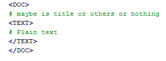

.. -*- coding: utf-8 -*-

============
Introduction
============
A very short introduction into topic models and how to solve them using topicmodel-lib. This document also introduces some basic concepts and conventions.

---------------------------
Topic models
---------------------------
Topic models are probabilistic models of document collections that use latent variables to encode recurring patterns of word use (Blei, 2012). Topic modeling algorithms are inference algorithms; they uncover a set of patterns that pervade a collection and represent each document according to how it exhibits them. These patterns tend to be thematically coherent, which is why the models are called "topic models." Topic models are used for both descriptive tasks, such as to build thematic navigators of large collections of documents, and for predictive tasks, such as to aid document classification. Topic models have been extended and applied in many domains

`Latent Dirichlet Allocation (LDA)`_ is the simplest topic model, LDA is a generative probabilistic model for collections of discrete data such as text corpora.

.. _Latent Dirichlet Allocation (LDA): ./LatentDirichletAllocation.rst

Large-scale learning
====================
Modern data analysis requires computation with massive data. These problems illustrate some of the challenges to modern data analysis. Our data are complex and high-dimensional; we have assumptions to make from science, intuition, or other data analyses that involve structures we believe exist in the data but that we cannot directly observe; and finally, our data sets are large, possibly even arriving in a never-ending stream. We deploy this library to computing with graphical models that are appropriate for massive datasets, data that might not fit in memory or even be stored locally. This is an efficient tool for learning LDA at large scales

Learning methods for LDA
========================
To learn LDA at large-scale, a good and efficient approach is stochastic learning (online/streaming methods). The learning process includes 2 main steps:

- Inference for individual document: infer to find out the **hidden local variables**: topic proportion :math:`\theta` or topic indices **z**. To deal with this, we can estimate directly or estimate their distribution P(:math:`\theta` | :math:`\gamma`), P(**z** | :math:`\phi`) (:math:`\gamma`, :math:`phi` called "variational parameters"). 
- Update **global variable** in a stochastic way to find out directly topics :math:`\beta` or we can estimate topics by finding out its distribution P(:math:`\beta` | :math:`\lambda`) (estimating variational parameter :math:`\lambda`). Global variable here maybe :math:`\beta` or :math:`\lambda` depend on each stochastic methods.

Indeed, this phase is as same as training step in machine learning. 

======
Corpus
======

A corpus is a collection of digital documents. This collection is the input to topicmodel-lib from which it will infer the structure of the documents, their topics, topic proportions, etc. The latent structure inferred from the corpus can later be used to assign topics to new documents which were not present in the training corpus. For this reason, we also refer to this collection as the training corpus. No human intervention (such as tagging the documents by hand) is required - the topic classification is unsupervised.

-----------
Data Format
-----------

Because we need to learn the model from the massive data, the loading whole of training data into memory is a bad idea. Corpus used for training should be stored in a file and with a specific format. Our library supports 3 formats of data:

Raw Text
========
  
::

  raw_corpus = ["Human machine interface for lab abc computer applications",
                "A survey of user opinion of computer system response time",
                "The EPS user interface management system",
                "System and human system engineering testing of EPS",              
                "Relation of user perceived response time to error measurement",
                "The generation of random binary unordered trees",
                "The intersection graph of paths in trees",
                "Graph minors IV Widths of trees and well quasi ordering",
                "Graph minors A survey"]

The raw corpus must be stored in a file. Each document is placed in 2 pair tag <DOC></DOC> and <TEXT></TEXT> as follow

You can see `raw AP corpus`_ for example

.. _raw AP corpus: https://github.com/TruongKhang/documentation/blob/master/examples/ap/data/ap_infer_raw.txt

Term-frequency (tf)
===================

Term-frequency format (**tf**) is derived from `Blei, 2003`_. This is a corpus which we achieve after preprocessing raw corpus. We also extract to a vocabulary set for that corpus (unique terms in whole corpus) 

.. _`Blei, 2003`: http://www.cs.columbia.edu/~blei/lda-c/

Under LDA, the words of each document are assumed exchangeable.  Thus, each document is succinctly represented as a sparse vector of word counts. The data is a file where each line is of the form:

`[N] [term_1]:[count] [term_2]:[count] ...  [term_N]:[count]`

where [N] is the number of unique terms in the document, and the [count] associated with each term is how many times that term appeared in the document.  Note that [term_i] is an integer which indexes the term (index of that term in file vocabulary); it is not a string.

For example, with corpus as raw_corpus above and file vocabulary is:

::

       0. "human"
       1. "machine"
       2. "interface"
       3. "lab"
       4. "abc"
       5. "computer"
       6. "applications"
       7. "survey"
       8. "user"
       9. "opinion"
       10. "system"
       11. "response"
       12. "time"
       13. "eps"
       14. "management"
       15. "engineering"
       16. "testing"
       17. "relation"
       18. "perceived"
       19. "error"
       20. "measurement"
       21. "generation"
       22. "random"
       23. "binary"
       24. "unordered"
       25. "trees"
       26. "intersection"
       27. "graph"
       28. "paths"
       29. "minors"
       30. "widths"
       31. "quasi"
       32. "ordering"

The **tf** format of corpus will be:
     
::

       7 0:1 1:1 2:1 3:1 4:1 5:1 6:1 
       7 7:1 8:1 9:1 5:1 10:1 11:1 12:1 
       5 13:1 8:1 2:1 14:1 10:1 
       5 10:2 0:1 15:1 16:1 13:1 
       7 17:1 8:1 18:1 11:1 12:1 19:1 20:1 
       5 21:1 22:1 23:1 24:1 25:1 
       4 26:1 27:1 28:1 25:1 
       6 27:1 29:1 30:1 25:1 31:1 32:1 
       3 27:1 29:1 7:1 

Term-sequence (sq)
==================

Each document is represented by a sequence of token as follow
    
`[token_1] [token_2] [token_3]....`

[token_i] also is index of that token in vocabulary file, not a string. (maybe exist that [token_i] = [token_j]) 
The **sq** format of the corpus above will be:

::

       0 1 2 3 4 5 6 
       7 8 9 5 10 11 12 
       13 8 2 14 10 
       10 0 10 15 16 13 
       17 8 18 11 12 19 20 
       21 22 23 24 25 
       26 27 28 25 
       27 29 30 25 31 32 
       27 29 7 

====================
Guide to learn model
====================

In this phase, the main task is to find out the global variable (topics) - in this project, we call it named `model` for simple. We designed the state-of-the-art methods (online/streaming learning): `Online VB`_, `Online CVB0`_, `Online CGS`_, `Online OPE`_, `Online FW`_, `Streaming VB`_, `Streaming OPE`_, `Streaming FW`_, `ML-OPE`_, `ML-CGS`_, `ML-FW`_

.. _Online VB: ./methods/online_vb.rst
.. _Online CVB0: ./methods/online_cvb0.rst
.. _Online CGS: ./methods/online_cgs.rst
.. _Online OPE: ./methods/online_ope.rst
.. _Online FW: ./methods/online_fw.rst
.. _Streaming VB: ./methods/streaming_vb.rst
.. _Streaming OPE: ./methods/streaming_ope.rst
.. _Streaming FW: ./methods/streaming_fw.rst
.. _ML-OPE: ./methods/ml_ope.rst
.. _ML-CGS: ./methods/ml_cgs.rst
.. _ML-FW: ./methods/ml_fw.rst

All of this methods are used in the same way. So, in this guide, we'll demo with a specific method such as Online VB. This method is proposed by Hoffman-2010, using stochastic variational inference

----------------
Data Preparation
----------------
Make sure that your training data must be stored in a text file and abide by the `Data Format`_: **tf**, **sq** or **raw text**

We also support the `preprocessing`_ module to work with the raw text format, you can convert to the tf or sq format. But if you don't want to use it, it's OK because we integrated that work in class ``DataSet``. Therefore, the first thing you need to do is create an object ``DataSet``

::

  from tmlib.datasets import DataSet
  # data_path is the path of file contains your training data
  data = DataSet(data_path, batch_size=5000, passes=5, shuffle_every=2)

The statement above is used when `data_path` is the raw text format. If your training file is the tf or sq format. You need to add an argument is the vocabulary file of the corpus as follow:

::

  # vocab_file is the path of file vocabulary of corpus
  data = DataSet(data_path, batch_size=5000, passes=5, shuffle_every=2, vocab_file=vocab_file)

The parameters **batch_size**, **passes**, **shuffle_every** you can see in `documentation here`_

.. _documentation here: ./methods/online_vb.rst
.. _preprocessing: ./preprocessing.rst

--------
Learning
--------

First, we need to create an object ``OnlineVB``:

::

  from tmlib.lda import OnlineVB
  onl_vb = OnlineVB(data=data, num_topics=100, alpha=0.01, eta=0.01, tau0=1.0, kappa=0.9)

``data`` is the object which created above. Parameter **num_topics** number of requested latent topics to be extracted from the training corpus. **alpha**, **eta** are hyperparameters of LDA model that affect sparsity of the topic proportions (:math:`\theta`) and topic-word (:math:`\beta`) distributions. **tau0**, **kappa** are learning parameters which are used in the update global variable step (same meaning as learning rate in the gradient descent optimization)

Start learning by call function **learn_model**:

::

  model = onl_vb.learn_model()

The returned result is an object `LdaModel`_

.. _LdaModel: ./ldamodel.rst

You can also save the model (:math:`\beta` or :math:`\lambda`) or some statistics such as: learning time, sparsity of document in the learning process

::

  model = onl_vb.learn_model(save_statistic=True, save_model_every=2, compute_sparsity_every=2, save_top_words_every=2, num_top_words=10, model_folder='models')

The result is saved in folder `models`. More detail about this parameters, read `here`_

.. _here: ./methods/online_vb.rst

One more thing, the topic proportions (:math:`\theta`) of each document in the corpus can be saved in a file ``.h5``. This work is necessary for `visualization`_ module but it'll make the learning time slower. So, be careful when using it!

::

  # for example: path_of_h5_file = 'models/database.h5'
  model = onl_vb.learn_model(save_topic_proportion=path_of_h5_file)

.. _visualization: ./visualization.rst

----------------------------
Saving model, display topics
----------------------------
After the learning phase as above, you can save the topic distribution (`model` - :math:`\beta` or :math:`\lambda`)

::

  # path_to_save is the path of file to save model
  model.save_model(path_to_save, file_type='binary')

File `path_to_save` is the ``.npy`` file if type of file is binary or is the ``.txt`` file if **file_type** is ``'txt'``

You also can display the topics discovered

::

  # display topics, print the top 10 words of each topic to screen
  model.print_top_words(10, data.vocab_file, display_result='screen')

If you want to save in a file:

::

  # path_file is to which data is saved
  model.print_top_words(10, data.vocab_file, display_result=path_file)

===========================
Inference for new documents
===========================
After learning phase, you have the `model` - topic distributions (:math:`\beta` or :math:`\lambda`). You want to infer for some documents to find out what topics these documents are related to. We need to estimate topic-proportions :math:`\theta`

First, create an object ``DataSet`` to load new documents from a file. 

If data format in that file is `Raw Text`_, you need the vocabulary file used in learning phase

::

  from tmlib.datasets import DataSet
  
  data = DataSet()
  # vocab_file is the vocabulary file used in learning phase
  new_corpus = data.load_new_documents(file_new_docs, vocab_file=vocab_file)

or if data format is the **tf** or **sq** format. The statement simply is:

::

  new_corpus = data.load_new_documents(file_new_docs)

After that, you have to load the model which is saved in the learning phase into object ``OnlineVB``

::

  # create object LdaModel
  learnt_model = LdaModel()
  # read topic distribution from file
  lda_model.load_model(path_file_to_read)

  # load lda_model into OnlineVB
  from tmlib.lda import OnlineVB
  online_vb = OnlineVB(lda_model=learnt_model)

Call ``infer_new_docs`` function to rum inference

::

  gamma = online_vb.infer_new_docs(new_corpus)
  # you can estimate topic proportion theta from variational parameter gamma
  theta = online_vb.estimate_topic_proportion(gamma)
  
=======
Example
=======
  
You can see in `example folder`_. We prepared the AP corpus including both raw corpus and term-frequency corpus. In here, we'll show code with both of type corpus and use method `Online OPE`_ (known is fast than Online VB)

.. _example folder: https://github.com/hncuong/topicmodel-lib/tree/master/examples/ap
.. _Online OPE: ./methods/online_ope.rst

- Raw AP corpus

  ::

    from tmlib.lda import OnlineOPE
    from tmlib.datasets import DataSet

    # data preparation
    data = DataSet(data_path='data/ap_train_raw.txt', batch_size=100, passes=5, shuffle_every=2)
    # learning
    onl_ope = OnlineOPE(data=data, num_topics=20, alpha=0.2)
    model = onl_vb.learn_model()
    # save model (beta or lambda)
    model.save_model('topic_distribution.npy')
    # display top 10 words of each topic
    model.print_top_words(10, data.vocab_file, display_result='screen')

    # inference for new documents
    vocab_file = data.vocab_file
    new_corpus = data.load_new_documents('data/ap_infer_raw.txt', vocab_file=vocab_file)
    topic_proportions = onl_ope.infer_new_docs(new_corpus)

  Topics:

  ::

    topic 0: water, environmental, people, trust, earth, pollution, taxes, claims, air, boat, 
    topic 1: year, people, years, mrs, police, time, day, family, state, women, 
    topic 2: percent, year, company, department, million, plant, health, state, report, study, 
    topic 3: police, government, people, military, iraq, army, killed, officials, israel, war, 
    topic 4: cent, cents, weather, lower, temperatures, bushel, snow, inches, coast, central, 
    topic 5: billion, deficit, housing, japan, japanese, trade, fair, cuba, imports, exports, 
    topic 6: cbs, abc, williams, miles, area, earthquake, quake, homeless, pope, john, 
    topic 7: bush, president, dukakis, states, reagan, congress, campaign, house, united, south, 
    topic 8: campaign, state, northern, mexico, republican, police, county, alabama, cuomo, governor, 
    topic 9: trade, takeshita, deconcini, oil, pension, committee, keating, fernandez, lawsuit, illness, 
    topic 10: court, case, attorney, trial, judge, federal, charges, law, justice, jury, 
    topic 11: party, government, political, workers, national, labor, opposition, people, elections, country, 
    topic 12: million, tax, sales, income, year, cash, estate, assets, money, billion, 
    topic 13: school, movie, film, board, parents, ban, mca, theater, roberts, fees, 
    topic 14: students, computer, farmers, teachers, smoking, schools, student, stolen, kasparov, faculty, 
    topic 15: dollar, yen, late, gold, london, bid, ounce, bank, thursday, dealers, 
    topic 16: percent, market, year, stock, million, prices, billion, rose, exchange, index, 
    topic 17: soviet, gorbachev, united, union, president, officials, west, year, germany, east, 
    topic 18: bill, senate, house, kennedy, sen, rep, measure, humphrey, director, thompson, 
    topic 19: meese, museum, disney, school, city, board, art, smith, buildings, memorial,

- tf format

  :: 
    
    from tmlib.lda import OnlineOPE
    from tmlib.datasets import DataSet

    # data preparation
    data = DataSet(data_path='data/ap_train.txt', batch_size=100, passes=5, shuffle_every=2, vocab_file='data/vocab.txt')
    # learning
    onl_ope = OnlineOPE(data=data, num_topics=20, alpha=0.2)
    model = onl_vb.learn_model()
    # save model (beta or lambda)
    model.save_model('topic_distribution.npy')
    # display top 10 words of each topic
    model.print_top_words(10, data.vocab_file, display_result='screen')

    # inference for new documents
    new_corpus = data.load_new_documents('data/ap_infer.txt')
    topic_proportions = onl_ope.infer_new_docs(new_corpus)

  Topics:

  ::

    topic 0: two, new, people, i, years, first, officials, time, fire, day, 
    topic 1: israel, minister, prime, vietnam, thatcher, party, opec, ministers, demjanjuk, labor, 
    topic 2: million, percent, futures, year, market, bank, analysts, new, cbs, nbc, 
    topic 3: dukakis, jackson, democratic, presidential, campaign, candidates, candidate, vote, voters, delegates, 
    topic 4: million, company, new, billion, inc, corp, board, year, court, federal, 
    topic 5: bush, united, states, president, trade, billion, house, congress, new, budget, 
    topic 6: stock, market, dollar, trading, exchange, yen, prices, late, index, rose, 
    topic 7: korean, korea, city, village, police, north, st, traffic, koreas, citys, 
    topic 8: police, people, killed, two, government, army, military, officials, three, city, 
    topic 9: south, africa, african, black, elections, party, national, war, mandela, blacks, 
    topic 10: states, united, nicaragua, noriega, drug, contras, court, coup, humphrey, manila, 
    topic 11: reagan, china, nuclear, study, b, prisoners, fitzwater, researchers, games, animals, 
    topic 12: i, new, people, years, percent, year, last, state, time, two, 
    topic 13: trial, case, prison, charges, convicted, jury, attorney, guilty, sentence, prosecutors, 
    topic 14: rain, northern, texas, inches, california, central, damage, santa, hospital, valley, 
    topic 15: soviet, government, gorbachev, union, party, president, political, two, news, people, 
    topic 16: service, offer, court, companies, firm, ruling, information, appeals, operations, services, 
    topic 17: water, care, homeless, environmental, pollution, fair, species, air, disaster, farm, 
    topic 18: percent, year, cents, oil, prices, west, german, rate, sales, price, 
    topic 19: air, plane, flight, two, iraq, soviet, force, kuwait, airport, iraqi,
