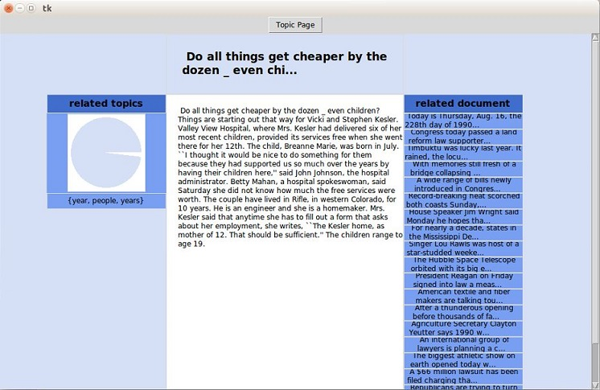

=============
Visualization
=============

Topic modeling is an unsupervised machine learning method that learns the underlying themes in a large collection of otherwise unorganized documents. This discovered structure summarizes and organizes the documents. However, topic models are high-level statistical tools—a user must scrutinize numerical distributions to understand and explore their results. So, we implemented a module visualization to reveal meaningful patterns in a collection, and helping end-users explore and understand its contents in new ways

You can read more detail about the methodology in [1]_

To use this module, make sure that the packages **pandas**, **Tkinter** are installed in your system 

::

  tmlib.visualization.visualize(model, database_path, data_path, vocab_file)
  
This function will visualize the topics, some documents in a GUI App. And this function takes 4 arguments :

- **model**: string or object class ``LdaModel``

  This argument can take 2 values: string if it's a path of file and object of class ``LdaModel`` you get after learning phase. If it is a path of file, this file is a file saving object ``LdaModel``
  
- **database_path**: string,

  This argument is path of file which stores topic proportions (:math:`\theta`) of documents. You need to save topic proportions in learning phase. Note: this file should be a file ``.h5`` and it is a database not only stores topic proportion but also stores content of documents
  
- **data_path**: string, 

  Path of file training data (corpus), you need the content of documents to visualize it
  
- **vocab_file**: string,

  File vocabulary of training corpus
  
-------
Example
-------

We'll demo with AP corpus. First, you need to learn model from this corpus using Online-OPE. Because you have to save topic proportions - this takes a long time. So, we need a fast learning algorithm

::

  from tmlib.lda import OnlineOPE
  from tmlib.datasets import DataSet

  data = DataSet(data_path='data/ap_train_raw.txt', batch_size=100, passes=5, shuffle_every=2)
  onl_ope = OnlineOPE(data=data, num_topics=20, alpha=0.2)
  # learn model and save topic proportions in file database 'database.h5'
  model = streaming_ope.learn_model(save_topic_proportions='database.h5')
  # save object model into file 'object_model.h5'
  model.save('object_model.h5')
  
After learning, file vocabulary extracted will be saved into ``~/tmlib_data/ap_train_raw/vocab.txt`` (you can see by run ``print data.vocab_file``). Now, we can visualize the result 

::

  import os
  from tmlib.visualization import visualize
  
  # get the vocabulary file
  vocab_file = os.path.expanduser('~/tmlib_data/ap_train_raw/vocab.txt')
  visualize('object_model.h5', 'database.h5', 'ap_train_raw.txt', vocab_file)
  
And this is the result you achieve

After you click on topic {years, people, years}

Click on the document with short content 'Do all things get cheaper by dozen_even...'

  
.. [1] Visualizing Topic Models. Allison J.B. Chaney and David M. Blei. Department of Computer Science. Princeton University, Princeton, NJ USA.